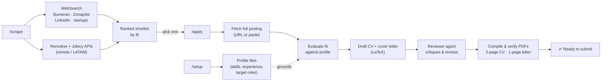

<p align="center">
   
</p>

# AI Job Search — Argentina 🇦🇷

An AI-powered job-application framework for the **Argentine market**, built on
[Claude Code](https://claude.com/claude-code). Fork it, fill in your profile, and let
Claude search job boards, evaluate fit, tailor your CV, write cover letters, and prep you for
interviews.

> This is an Argentine adaptation of [RinaldoG/ai-job-search-au](https://github.com/RinaldoG/ai-job-search-au)
> (originally built for Australia). The core workflow is the same; the job-discovery layer has
> been rebuilt for the Argentine market using **Remotive + Jobicy APIs** (standalone CLI)
> and **WebSearch** across Bumeran, Zonajobs, and LinkedIn (via the `/scrape` Claude Code skill).

## What this is

A structured workflow that turns Claude Code into a full job-application assistant:



**It tailors and reviews; it does not auto-submit.** You get finished, layout-verified
PDFs — you click "apply" and upload them yourself.

## Job discovery

Argentine job boards (Indeed AR, Bumeran, Zonajobs, Computrabajo) are all behind
Cloudflare or JavaScript-rendered SPAs — plain HTTP scraping cannot get through any of them.
Discovery works in two ways:

| Channel | How | Best for |
|---------|-----|----------|
| **`/scrape` skill** (Claude Code) | WebSearch across Bumeran, Zonajobs, LinkedIn + startup ATS boards | Local Argentine postings, on-site/hybrid, startup roles |
| **`tools/job-scraper` CLI** (Python) | Remotive + Jobicy public APIs — no key, no auth | Remote/LATAM roles, standalone use without Claude |


## Python with uv

This project uses **uv** as its Python package manager. Everything runs on Python 3.10+ stdlib only — no pip installs needed — but uv makes setup clean and fast:

```bash
# Install uv: https://docs.astral.sh/uv/getting-started/installation
brew install uv

# Create a virtual environment
uv venv
source .venv/bin/activate

# Install dev dependencies (optional)
uv pip install -e ".[dev]"
```

## Quick start

```bash
# 1. Clone (already done) — cd to this repo
cd /path/to/ai-job-search-ar

# 2. Start Claude Code and build your profile
claude
/setup

# 3. Search Indeed Argentina for matching roles
/scrape

# 4. Apply to one — paste an Indeed URL directly (full description is auto-fetched)
/apply https://ar.indeed.com/job/12345678
```

See **[INSTALL.md](INSTALL.md)** for everything to install (Claude Code, Python, LaTeX) —
including a **no-sudo LaTeX setup** that works on locked-down machines.

## The `job-scraper` tool (works standalone, no Claude needed)

```bash
# Search LATAM + Worldwide remote roles
python3 tools/job-scraper/job_scraper.py --keywords "Python Developer" --table

# LATAM only
python3 tools/job-scraper/job_scraper.py --keywords "ML Engineer" --region latam --table

# Worldwide only
python3 tools/job-scraper/job_scraper.py --keywords "Backend Engineer" --region worldwide --table

# JSON output (for piping / processing)
python3 tools/job-scraper/job_scraper.py --keywords "Data Scientist" > jobs.json

# Target specific categories
python3 tools/job-scraper/job_scraper.py --keywords "AI" --category artificial-intelligence data
```

Zero dependencies (Python 3.10+ stdlib only). Sources: **Remotive** and **Jobicy** public APIs.

**Regions:** `latam` (LATAM/Latin America/Argentina-eligible), `worldwide` (global remote), `any` (default — both).

## Job boards

| Board | Status | Notes |
|-------|--------|-------|
| **Remotive** | ✅ Primary (CLI) | `tools/job-scraper` — remote LATAM/worldwide roles, free API, no key |
| **Jobicy** | ✅ Primary (CLI) | `tools/job-scraper` — LATAM-focused remote roles, free API, no key |
| **Bumeran / Zonajobs** | ✅ via `/scrape` | WebSearch only — behind Cloudflare/SPA, not directly scrapable |
| **LinkedIn** | ⚠️ Optional, **off by default** | `/scrape linkedin` — **automating LinkedIn violates its ToS**; personal/low-volume use only |
| **Indeed Argentina** | ❌ Blocked | Fully behind Cloudflare; all endpoints return 403 or 404 |
| **Computrabajo** | ❌ Not supported | No usable public API; paste a posting into `/apply` instead |

### Optional: LinkedIn ⚠️

`tools/linkedin-search` adds LinkedIn coverage via its guest endpoints (no login, no key).
**LinkedIn's User Agreement prohibits automated access**, so this is **disabled by default in
`/scrape`** and intended for personal, low-volume use only — it can get your IP rate-limited.
Indeed Argentina is the primary, supported source. To opt in, run `/scrape linkedin`, or use
the tool directly:

```bash
cd tools/linkedin-search
python3 linkedin_search.py --keywords "AI Engineer" --where "Buenos Aires" --table
```

See [`tools/linkedin-search/README.md`](tools/linkedin-search/README.md) for the full warning
and options. If in doubt, don't use it — paste LinkedIn postings into `/apply` manually.

## Commands

| Command | What it does |
|---------|--------------|
| `/setup` | Build your profile — from your CV, a pasted resume, or an interview |
| `/scrape` | Search Bumeran, Zonajobs, LinkedIn + startup boards via WebSearch; rank results by fit |
| `/apply <url-or-text>` | Evaluate fit -> draft tailored CV + cover letter -> reviewer agent -> compile PDFs |
| `/expand` | Enrich your profile from public sources you've linked (GitHub, portfolio, etc.) |
| `/upskill` | Gap analysis between your profile and tracked postings -> learning plan |
| `/reset` | Wipe profile data to start over (asks for confirmation) |

## How `/apply` works

A **drafter–reviewer** workflow with mandatory PDF verification:

1. **Parse** the posting — a URL is fetched via WebFetch (company ATS pages work best);
   or paste the job text directly.
2. **Evaluate fit** against your profile (skills, experience, culture, location, salary).
3. **Draft** a tailored CV + cover letter in LaTeX.
4. **Reviewer agent** (fresh context) researches the company and critiques the drafts.
5. **Revise**, then **compile & visually inspect** both PDFs (lualatex for the CV, xelatex for
   the cover letter) until the CV is exactly 2 pages with no orphaned headings and the cover
   letter is exactly 1 page.
6. **Present** the finished files with a verification checklist.

All claims are checked against your real profile — the system never fabricates skills or
experience.

## Privacy ⚠️

Several files are **tracked by git** but get filled with your personal data by `/setup`
(name, contact details, employment history, search targets). On a public fork, **don't push
them.** The full list:

- `CLAUDE.md`
- `cv/main_example.tex`
- `.claude/skills/job-scraper/search-queries.md`
- `.claude/skills/job-application-assistant/{01-candidate-profile, 02-behavioral-profile,
   04-job-evaluation, 05-cv-templates, 07-interview-prep}.md`

**Enable the included safety hook once and it blocks committing these automatically:**

```bash
git config core.hooksPath .githooks
```

The `.gitignore` already protects your resume, search results, generated CVs/cover letters,
the tracker CSV, salary data, and the `documents/` folder. The files above are the exception
the hook covers. See [INSTALL.md → Keeping your data private](INSTALL.md#keeping-your-data-private).

## Customisation

- **Search queries:** edit `.claude/skills/job-scraper/search-queries.md` — role-title
  keywords and locations per priority.
- **LaTeX templates:** the CV uses [moderncv](https://ctan.org/pkg/moderncv); the cover
  letter uses a custom `cover.cls` with Lato/Raleway fonts. Swap in your own.
- **Salary benchmarking:** optional — supply `salary_data.json` (see `tools/README_SALARY_TOOL.md`).

## Credits

- **[RinaldoG/ai-job-search-au](https://github.com/RinaldoG/ai-job-search-au)** — the
  Australian framework this is adapted from.
- **[Mads Lorentzen](https://github.com/MadsLorentzen)** — the original
   [ai-job-search](https://github.com/MadsLorentzen/ai-job-search) framework.
- Built with [Claude Code](https://claude.com/claude-code) by [Anthropic](https://anthropic.com).

## License

MIT — see [LICENSE](LICENSE).
